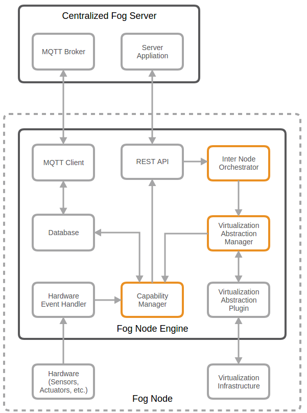

# Fog Node Prototype

Master: 
Development: 

* http://zeromq.org/intro:read-the-manual
* https://www.digitalocean.com/community/tutorials/how-to-work-with-the-zeromq-messaging-library
* https://github.com/channelcat/sanic

### Docker stuff

* https://docs.docker.com/engine/api/get-started/#list-and-manage-containers
* https://docker-py.readthedocs.io/en/stable/containers.html#docker.models.containers.Container
* https://docs.docker.com/engine/api/v1.29/#tag/Container

### MQTT

* http://www.steves-internet-guide.com/mqtt-username-password-example/
* https://www.dinotools.de/2015/04/11/mosquitto-als-mqtt-broker/
* http://www.hivemq.com/blog/mqtt-client-library-paho-python

### Python webserver

* https://www.digitalocean.com/community/tutorials/a-comparison-of-web-servers-for-python-based-web-applications

### Fog Node Engine Architecture

